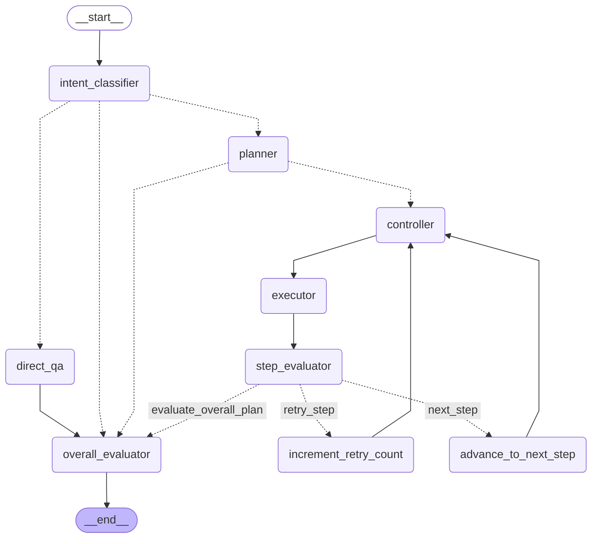

# Research Agent Graph Definition

Copy the code block below and paste it into a Mermaid.js viewer like [mermaid.live](https://mermaid.live) or a supporting Markdown editor to see the visual graph.

